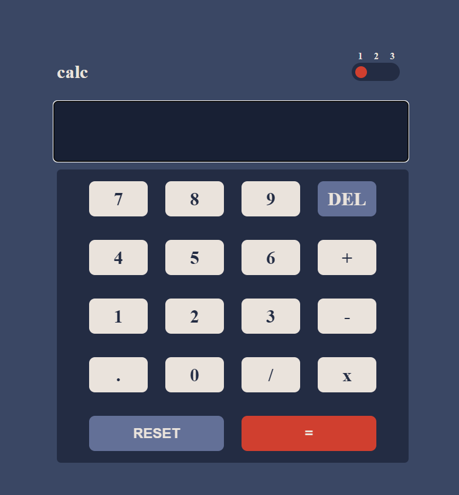

 

## Table of contents

## new was here   
  
  - [Screenshot](#screenshot)
  - [Links](#links)
- [My process](#my-process)
  - [Built with](#built-with)
  - [What I learned](#what-i-learned)
 
 
- [Author](#author)
 

**Note: Delete this note and update the table of contents based on what sections you keep.**

 
 

### Screenshot


 

### Links

- Solution URL: [Solution URL ](https://your-solution-url.com)
- Live Site URL: [Live URL](https://kumneger49.github.io/Calculator/)

## My process

### Built with

- Semantic HTML5 markup
- CSS custom properties
- Flexbox
- Mobile-first workflow
-js
 

**Note: These are just examples. Delete this note and replace the list above with your own choices**

### What I learned
 

 
```js
 function handleToggler(){
  
  if(toggler_index===1){
    toggler_disk.classList.toggle('toggler-disk-2');
    root.classList.toggle('root-white-theme');
    toggler_index++;
  }

  else if(toggler_index===2){
    toggler_disk.classList.toggle('toggler-disk-3');
    root.classList.toggle('root-purple-theme')
    toggler_index++;
  }

  else{
    toggler_disk.classList.remove('toggler-disk-2');
    root.classList.remove('root-white-theme');
    toggler_disk.classList.remove('toggler-disk-3');
    root.classList.remove('root-purple-theme')
    toggler_index=1;
  }
}
```

 

### Continued development

algorithm and effiecient program writing


## Author

- Website - [Add your name here](https://www.your-site.com)
- Frontend Mentor - [@Kumneger](https://www.frontendmentor.io/profile/kumneger)
 
 
 
